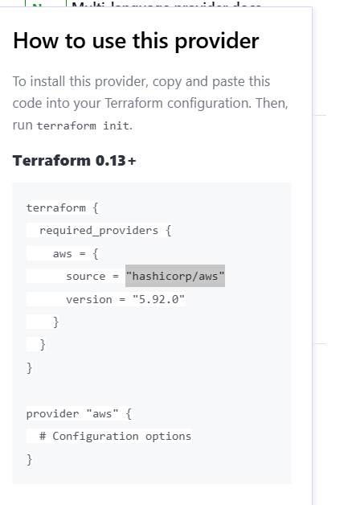
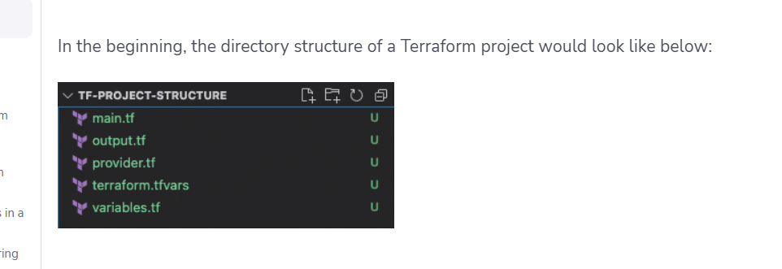

## Project - 1: Creating AWS EC2 server using the terraform:

### Setup required :

- AWS Account
- Terraform install

### Steps :

1. Provide the terraform provider , here we are using "aws" provider. For reference , how to use the aws provider check this link 👉 : https://registry.terraform.io/providers/hashicorp/aws/latest/docs

2. You can use this below images as well for more clarity: 

3. Specify the ami id for your EC2 server using **data source block** which basically give the information using API query

4. 

5. https://spacelift.io/blog/terraform-tfvars

